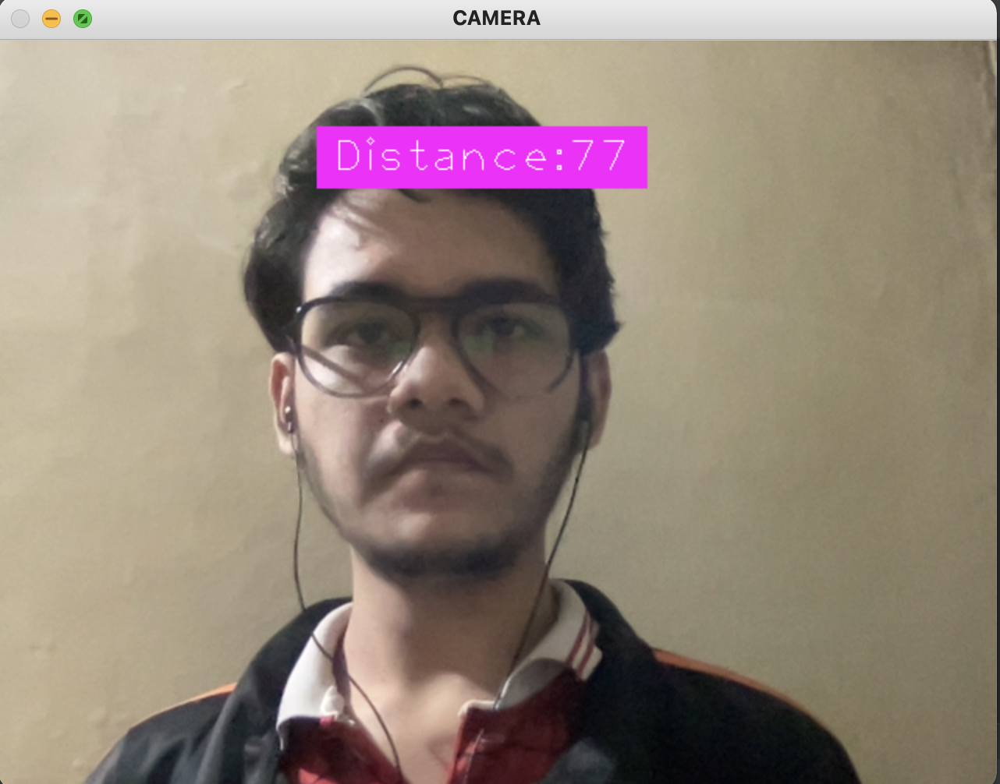
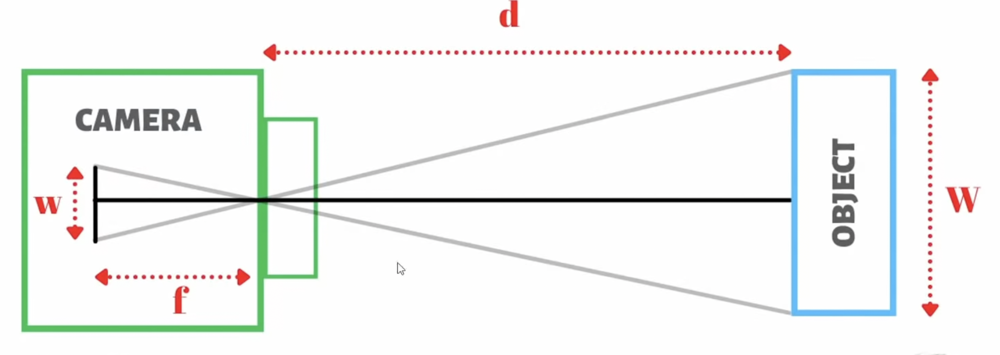
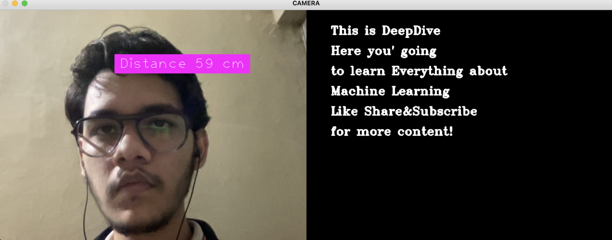
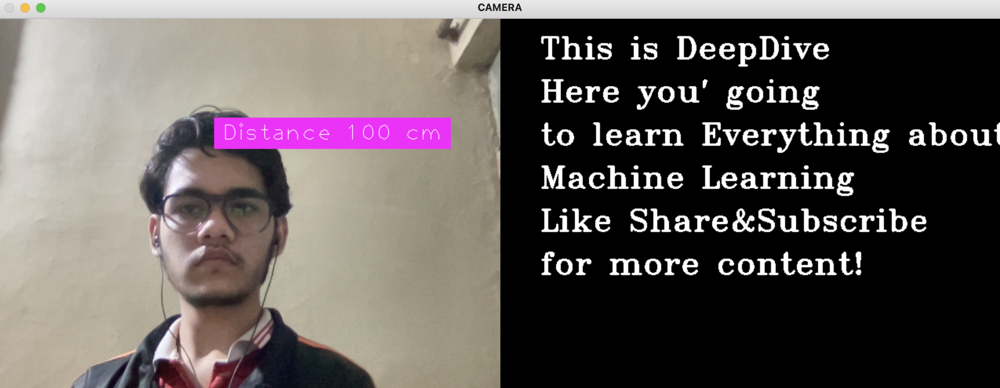

# Face Distance Measurement 

As you can see in the image we'll try to tell the distance of our face from the camera using computer vision, using the openCV library.
## Libraries 
1. openCV
2. cvzone (<u>optional: it already has some pre-build classes to detect the face and calculate the distance between two point, stack images together etc.</u>)
3. Numpy

## Approach 

Here we have used the concept of basic pinhole camera to first find the focal length of the our webcam first then use it to find the depth in quetion. 
And we've used <u>*our eyes*</u> as reference because even though the face features vary from person to person but the distance between the eyes is almost same at about 6.3cm avg for both men and women.

# DynamicTextReader 
This is one of the applications of the above project we created. The basic idea is based on your distance from the computer, it will automatically change the text size, you know, automatic zooming based on your distance, Cool! right?
Here is how it looks : 

<h4>Close</h4>

<h4>Far</h4>

